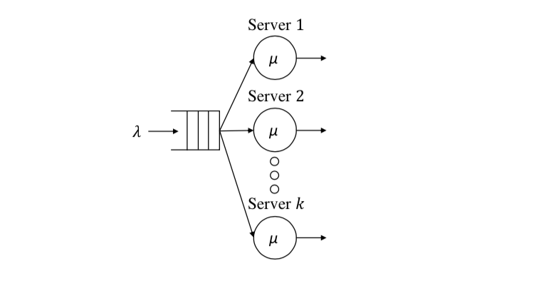
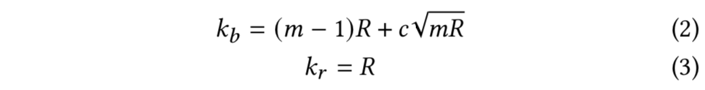

# Scalling Policy

Both predictive and reactive scaling algorithms can be applied on BIAS Autoscaler. 
However, we chose an reactive approach to scale our resources. 
Our reactive strategy assumes that the future demand resembles the current state. 
We use the well accepted Square-Root Staffing Rule (SR Rule) as our scaling 
strategy for BIAS Autoscaler. We assume 
that our load balancer, the Google Cloud Load Balancer, follows the Join the 
Shortest Queue (JSQ) model. From that, based on the previous development 
done by on H. -. Lin and C. S. Raghavendra, we consider our system as a 
M/M/k queueing system, which is shown in the figure below.

Let `m` be the overprovisioning constant to overprovision our resource
 to handle an arrival rate `m * $lambda$` . Then, the total number of predicted 
 servers is `k_i = k_r + k_b` where equation 2 defines the number of required 
 burstable instances `k_b` and equation 3 is the necessary regular ones `k_r`,

### Index

1. [Quick Start](../src/1-quick-start.md)
   - [Run Autoscaler](../src/1-1-run.md)
   - [Configure Autoscaler](../src/1-2-configure.md)
2. [Scaling Policy](../src/2-scaling-policy.md)
3. [Autoscaler Architecture](../src/3-architecture.md)
   - [Monitor](../src/3-1-monitor.md)
   - [Scaling Policy](../src/3-2-scaling-policy.md)
   - [Controller](../src/3-3-controller.md)
4. [Benchmark Tests](../src/4-benchmark-tests.md)
5. [APIs](../src/5-apis.md)
