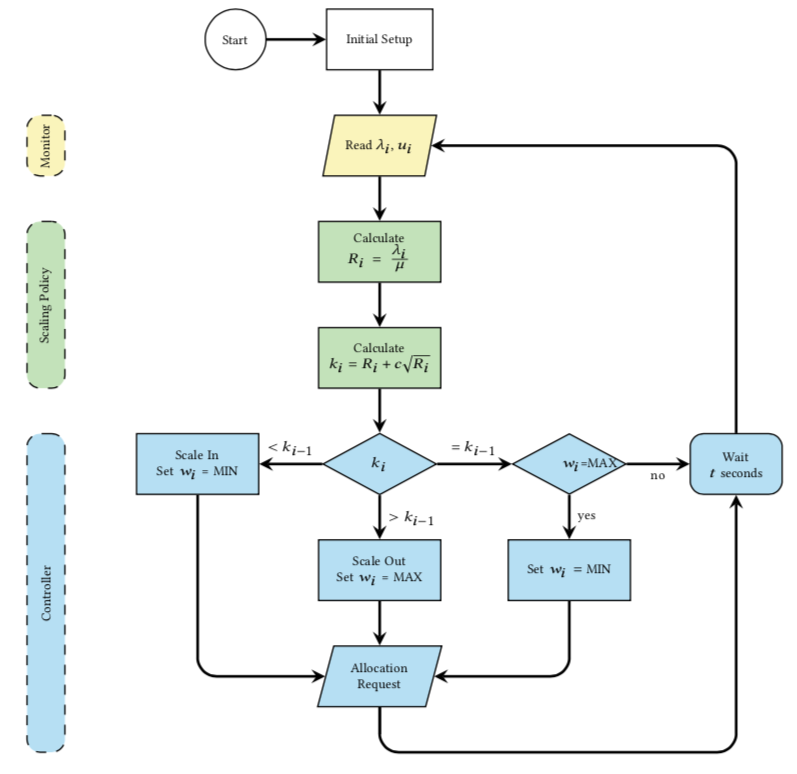

# Monitor
The monitor component is in charge of acquiring metrics from the Google 
Load Balancer and from the Google Compute Engine
 instances through the Google Cloud Monitoring service. 
 The user can set the frequency by which it fetches 
these metrics, or use the default value which is 60 seconds. 
They can also configure the time series period to get and process 
historical data from the cluster. Each time the autoscaler 
fetches these metrics, it saves the last three entries 
for internal processing by default. Currently, it fetches 
metrics of CPU utilization and number of the burstable and 
regular instances, arrival rate per instance type, and load balancer 
configurations such as the CPU utilization threshold of the burstable 
instances. All metrics are then provided to the scaling policy and 
controller components at the predefined frequency and configuration.

### Index

1. [Quick Start](../src/1-quick-start.md)
   - [Run Autoscaler](../src/1-1-run.md)
   - [Configure Autoscaler](../src/1-2-configure.md)
2. [Scaling Policy](../src/2-scaling-policy.md)
3. [Autoscaler Architecture](../src/3-architecture.md)
   - [Monitor](../src/3-1-monitor.md)
   - [Scaling Policy](../src/3-2-scaling-policy.md)
   - [Controller](../src/3-3-controller.md)
4. [Benchmark Tests](../src/4-benchmark-tests.md)
5. [APIs](../src/5-apis.md)
