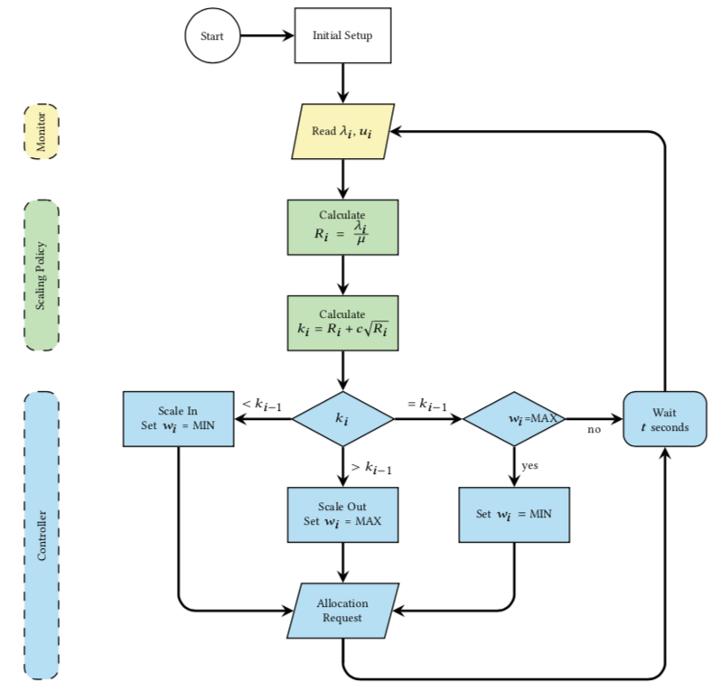

# Scaling 
This is where the scaling algorithm is implemented. Currently, it only supports the SR Rule.

### Implementing Your Own Scaling Algorithm
Any scaling strategy can be used on BIAS Autoscaler. In order to do so, you need to create
and implement the same methods as the ones on [SquareRootStaffing](https://github.com/jaimedantas/BIAS-autoscaler/blob/main/src/main/java/com/jaimedantas/autoscaler/scaling/SquareRootStaffing.java).
```
autoscaler
└───scaling
    └──Resource.java
    └──ResourceValidator.java
    └──SquareRootStaffing.java
```
Only two methods are required: one that outputs de number of burstable instances, and 
another one for the regular ones. The example below illustrates how you can implement your own methods for scaling. 
 
 ```java
    /**
     * Calculates the Square Root Stafding k = R + c * sqrt(R)
     * The regular instances is R
     * @param r arrival/mu
     * @return the number of regular instances RD
     */
    public int calculateNumberOfRegularInstances(long r){
        return (int) r;
    }

    /**
     * Calculates the Square Root Stafding k = R + c * sqrt(R)
     * The burstable instances is c * sqrt(R)
     * @param r arrival/mu
     * @return the number of burstable instances (k - R)
     */
    public int calculateNumberOfBurstableInstances(long r) throws InvalidProbabilityQueueException {
        return (int) Math.round(r + getProbabilityQueue() * Math.sqrt(r));
    }
```
If your strategy needs to read the current and past metrics, you can do so by calling any of the methods 
from the monitor component. For example, if you need the total number of instances, just call `getNumberOfInstances()`.



### Index

1. [Quick Start](../src/1-quick-start.md)
   - [Run Autoscaler](../src/1-1-run.md)
   - [Configure Autoscaler](../src/1-2-configure.md)
2. [Scaling Policy](../src/2-scaling-policy.md)
3. [Autoscaler Architecture](../src/3-architecture.md)
   - [Monitor](../src/3-1-monitor.md)
   - [Scaling](../src/3-2-scaling.md)
   - [Controller](../src/3-3-controller.md)
4. [Benchmark Tests](../src/4-benchmark-tests.md)
5. [APIs](../src/5-apis.md)
