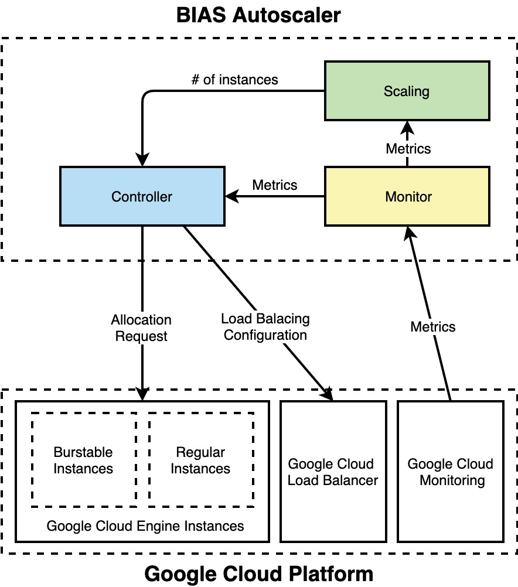

# Architecture
BIAS Autoscaler is a ready-to-use autoscaler with little to no con- figuration 
required for GCP. To the best of our knowledge, BIAS Autoscaler is the first 
open-sourced autoscaler for GCP that leverages burstable instances for 
scaling Google Compute Engine instances. BIAS Autoscaler is also the 
first autoscaler to use the Google Load Balancer to dynamically change 
the traffic distribution among the instances. It uses the existing GCP 
services to manage and monitor the cluster, and it was developed using the
 Java programming language in combination with the Micronaut Framework. 
 We used the Google Cloud Java API and SDK  for scaling and 
 controlling the cluster, and the Google Cloud Stackdriver Monitoring 
 Client for monitoring the necessary metrics. BIAS Autoscaler can be
  deployed either on a Google Compute Engine instance or run as a 
  container on Google Kubernetes Engine. It is a reactive autoscaler
   that uses the Google Load Balancer to adjust the CPU utilization 
   of the burstable instances based on traffic distribution. The figure 
   5 shows how BIAS Autoscaler is used to autoscaler the resources on GCP
   
Its architecture is divided into three distinct modules: monitor, 
scaling policy and controller. Each of these modules has clear 
borders internally, and the user can set their own scaling algorithm, 
as well as the desired SLOs and re- source configuration. 
The internal architecture of BIAS Autoscaler is shown in the figure below.

 

### Index

1. [Quick Start](../src/1-quick-start.md)
   - [Run Autoscaler](../src/1-1-run.md)
   - [Configure Autoscaler](../src/1-2-configure.md)
2. [Scaling Policy](../src/2-scaling-policy.md)
3. [Autoscaler Architecture](../src/3-architecture.md)
   - [Monitor](../src/3-1-monitor.md)
   - [Scaling Policy](../src/3-2-scaling-policy.md)
   - [Controller](../src/3-3-controller.md)
4. [Benchmark Tests](../src/4-benchmark-tests.md)
5. [APIs](../src/5-apis.md)
