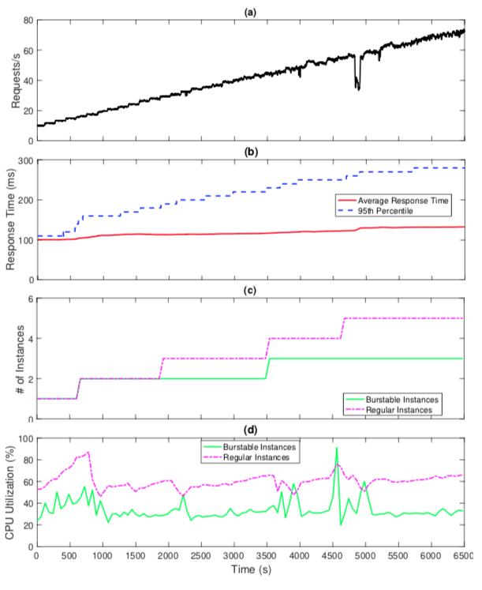

# Benchmark Test
We conducted several different experiments to evaluate the performance 
of BIAS Autoscaler for scaling Google Compute Engines.
on GCP. The workload used for testing was the [Load Microservice](https://github.com/jaimedantas/load-microservice/),
and the [Locus](https://locust.io/) benchmark testing tool was used for generating the
user traces. We analyzed the performance of our autoscaler during
a transient queuing in traffic in two distinct scenarios, then we
compare our performance to the rule-based GCP autoscaler. 
For this comparison, we investigate the QoS metrics and evaluate the
SLOs violations for each test.

The average response time and the 95th percentile (b) 
for a fixed increasing arrival rate (a) is under the SLO,
 and the burstable and regular instances are used by BIAS Autoscaler 
 to reduced resource cost (c & d).

**Results**: We reduced the cost by 25% when replacing some conventional 
instances with burstable ones.

This 25% cost savings can be understood better when we analyze 
the resource utilization during the two test scenarios. 
While we maintained an average CPU usage of our resources 
of approximately 45% when running with regular instances only, 
this figure was roughly 64% when we combine burstable and regular ones. 
As a result, we increased our cluster efficiency by 42% when using a combination 
of these two instance types. This demonstrates how BIAS Autoscaler 
can be used to not only cut the cost, but also to increase overall cluster efficiency.

### Index

1. [Quick Start](../src/1-quick-start.md)
   - [Run Autoscaler](../src/1-1-run.md)
   - [Configure Autoscaler](../src/1-2-configure.md)
2. [Scaling Policy](../src/2-scaling-policy.md)
3. [Autoscaler Architecture](../src/3-architecture.md)
   - [Monitor](../src/3-1-monitor.md)
   - [Scaling Policy](../src/3-2-scaling-policy.md)
   - [Controller](../src/3-3-controller.md)
4. [Benchmark Tests](../src/4-benchmark-tests.md)
5. [APIs](../src/5-apis.md)
