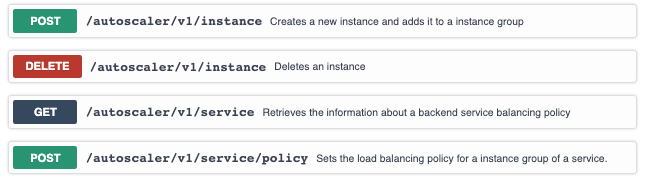

# APIs

You can manage your cluster by calling the different APIs from BIAS Autoscaler.

### Swagger
We implemented Swagger on BIAS Autoscaler.
 

 

### Index

1. [Quick Start](../src/1-quick-start.md)
   - [Run autoscaler](../src/1-1-run.md)
   - [Configure autoscaler](../src/1-2-configure.md)
2. [Scaling Policy](../src/2-scaling-policy.md)
3. [Autoscaler Architecture](../src/3-architecture.md)
   - [Monitor](../src/3-1-monitor.md)
   - [Scaling Policy](../src/3-2-scaling-policy.md)
   - [Controller](../src/3-3-controller.md)
4. [Benchmark Tests](../src/4-benchmark-tests.md)
5. [APIs](../src/5-apis.md)
